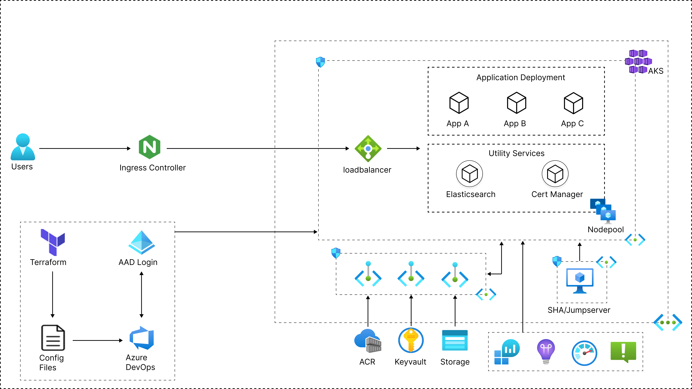

# terraform-azure-aks-accelerator

## Deploys a Kubernetes cluster (AKS) on Azure with public/private connectivity support and seamless intergetion with other services.

Deploys a Kubernetes cluster (AKS) on Azure with public/private connectivity support and seamless intergetion with other services.

-> **NOTE:** If you have not assigned `client_id` or `client_secret`, A `SystemAssigned` identity will be created.

In most cases, you will need to adjust your Terraform code to accommodate the changes introduced in the new major version. I strongly recommend reviewing the changelog and migration guide to understand the modifications and ensure a smooth transition.

## Pre-requisites
- [Configure Terraform for Azure](https://docs.microsoft.com/en-us/azure/virtual-machines/linux/terraform-install-configure)

I assumed that you have setup service principal's credentials in your environment variables like below:

```shell
export ARM_SUBSCRIPTION_ID="<azure_subscription_id>"
export ARM_TENANT_ID="<azure_subscription_tenant_id>"
export ARM_CLIENT_ID="<service_principal_appid>"
export ARM_CLIENT_SECRET="<service_principal_password>"
```

On Windows Powershell:

```shell
$env:ARM_SUBSCRIPTION_ID="<azure_subscription_id>"
$env:ARM_TENANT_ID="<azure_subscription_tenant_id>"
$env:ARM_CLIENT_ID="<service_principal_appid>"
$env:ARM_CLIENT_SECRET="<service_principal_password>"
```
## License

[MIT](LICENSE)

## Requirements

| Name | Version |
|------|---------|
| <a name="requirement_terraform"></a> [terraform](#requirement\_terraform) | >= 1.3 |
| <a name="requirement_azurerm"></a> [azurerm](#requirement\_azurerm) | >= 3.107.0, < 4.0 |

## Providers

| Name | Version |
|------|---------|
| <a name="provider_azurerm"></a> [azurerm](#provider\_azurerm) | >= 3.107.0, < 4.0 |

## Modules

No modules.

## Reference Architecture
